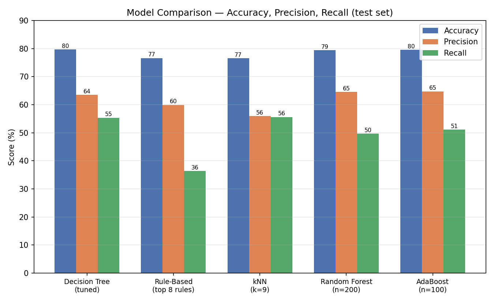
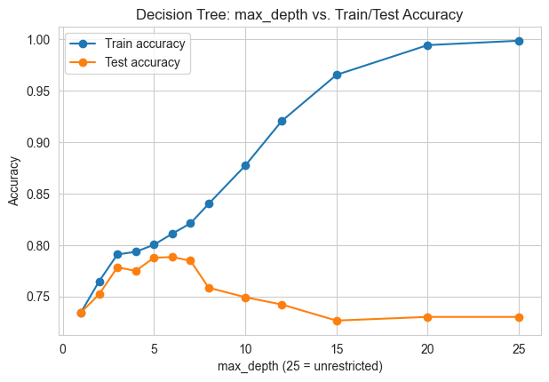

# Telco Customer Churn — Comparing Five Classification Approaches

Predicts whether a telecom customer will cancel their service, comparing five classification methods head-to-head — Decision Tree, Rule-Based Classification, k-Nearest Neighbors, Random Forest, and AdaBoost — on the same data, tuned and evaluated the same way, for a fair comparison.

## Why this project

Telecom providers usually only find out a customer is leaving when the cancellation request arrives. This project builds models that flag at-risk customers ahead of time using their contract, billing, and service data — and, since no single algorithm is always the right choice, it compares five different approaches to see which one actually earns its complexity on this problem.

## Results

| Model | Accuracy | Precision | Recall | Specificity |
|---|---|---|---|---|
| Decision Tree (tuned) | 79.67% | 63.50% | 55.35% | 88.48% |
| Rule-Based (top 8 rules) | 76.62% | 59.91% | 36.36% | 91.19% |
| kNN (k=9) | 76.55% | 55.91% | 55.61% | 84.12% |
| Random Forest (n=200) | 79.39% | 64.58% | 49.73% | 90.13% |
| AdaBoost (n=100) | 79.60% | 64.75% | 51.07% | 89.93% |

The top three models sit within 0.8 points of each other on accuracy — the tuned Decision Tree edges out both ensembles while staying fully interpretable, a strong combination for a use case where a retention team needs to understand *why* a customer was flagged, not just that they were.

Every model is structurally better at confirming loyal customers (Specificity) than catching true churners (Recall) — a direct consequence of the ~73.5% / 26.5% class imbalance in the data, not a flaw specific to any one algorithm.

An unconstrained Decision Tree overfits hard — ~99.9% training accuracy but only ~73% on test data. Tuning `max_depth` and `min_samples_leaf` closed that gap and pushed test accuracy up to 79.67%.

## Dataset

7,043 telecom customers, 21 original attributes (demographics, account/contract details, services, billing) → 29 numerical columns after encoding. Target: No Churn (73.5%) / Churn (26.5%).

## Approach

- **Data cleaning:** `TotalCharges` mis-typed as text revealed 11 missing values, all brand-new customers with zero tenure — a structural, explainable gap, so those 11 rows (0.16% of data) were dropped rather than imputed
- **Encoding:** one-hot encoding for unordered categories (payment method, internet type); ordinal encoding for `Contract` (month-to-month → one-year → two-year), preserving its genuine order instead of flattening it
- **Scaling:** numeric features standardized on training-set statistics only, critical for kNN's distance calculations
- **Split:** 80/20 train/test, stratified to preserve the churn/no-churn ratio in both sets
- **Five models, tuned and compared fairly:**
  - **Decision Tree** — `max_depth` and `min_samples_leaf` swept individually against test accuracy
  - **Rule-Based** — top 8 rules extracted from the tuned tree by support, with a majority-class fallback
  - **kNN** — k swept from 1–9; scaling tested explicitly (scaled beat unscaled by 1.42 points at k=5)
  - **Random Forest** — number of trees swept; feature importances cross-checked against the tree's own splits
  - **AdaBoost** — number of estimators swept, showing a genuine peak rather than Random Forest's flat plateau

## Key findings

- **Contract length is the dominant signal** — month-to-month customers churn at ~43%, one-year at ~11%, two-year at just ~3%, a 14x spread and the largest gap of any factor examined
- **Fiber optic internet is the second-strongest signal**, and counterintuitively the highest-risk service tier (~42% churn vs. ~19% for DSL) — likely price sensitivity or satisfaction issues with the premium product
- **Tenure and total charges track together** — churn is heavily concentrated in a customer's first few months
- **Ensembles trade recall for precision** — Random Forest and AdaBoost win on precision and overall accuracy, but both score lower on recall than the single Decision Tree or kNN, meaning they're more conservative about flagging the minority churn class

## A methodology gap I flagged myself

All hyperparameter tuning here (tree depth, k, number of estimators) was chosen by directly watching test-set accuracy — which means the test set was effectively used to select the models, not just to evaluate them at the end. A cleaner setup would carve out a separate validation set (e.g. 70/15/15) for tuning, and touch the test set exactly once for a final, honest comparison. Noting this rather than presenting the numbers as fully clean.

## Future work

- Introduce a proper validation set to remove the tuning/evaluation leakage above
- Lower the default 0.5 decision threshold — likely worthwhile, since missed churners probably cost more than an unnecessary retention offer
- k-fold cross-validation to confirm the top-three model ranking is stable, given they sit within 1 point of each other
- Explicit imbalance handling (SMOTE or class weighting) as a complementary way to lift recall
- Systematic hyperparameter search in place of the manual sweeps used here

## Tech

Python · pandas · scikit-learn · matplotlib · seaborn
